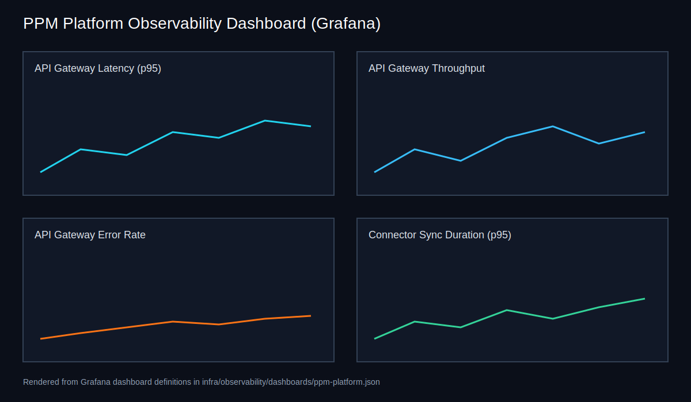
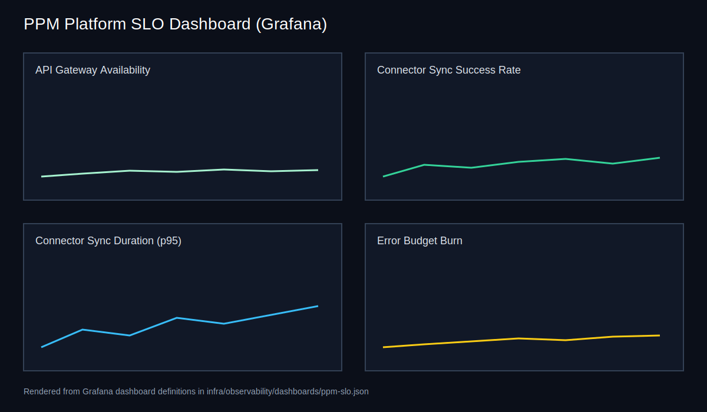

## Observability

Observability spans the API gateway, orchestration runtime, and connector layer. Telemetry feeds the System Health agent and the Continuous Improvement agent so they can detect degradations and drive improvements.

### Telemetry standards

- **Logs**: structured logs exported via OpenTelemetry and correlated with trace context.
- **Metrics**: request latency, error rates, throughput, connector sync duration/success, per-agent execution duration, retries, and execution cost.
- **Traces**: end-to-end spans across request routing, orchestration, and connector sync operations.

#### Log schema (example)

```json
{
  "timestamp": "2026-01-15T14:30:00Z",
  "service": "agent-orchestrator",
  "trace_id": "trace-123",
  "level": "INFO",
  "message": "Plan executed",
  "context": {"intent": "create_project"}
}
```

### Correlation IDs and cost telemetry

Every top-level user request receives a `correlation_id` (UUID) that propagates through orchestrator context and downstream agent calls. Structured logs, audit events, and metrics include `correlation_id` so one query can be traced end-to-end across all participating agents.

Agent metrics include:

- `agent_execution_duration_seconds` histogram tagged with `agent_id`, `task_id`, and `correlation_id`.
- `agent_retries_total` counter tagged by the same dimensions.
- `agent_errors_total` counter tagged by the same dimensions.
- Cost counters (`external_api_cost`, `llm_tokens_consumed`) tagged with `correlation_id` for request-level attribution.

### SLO/SLI targets

| SLI | Target | Notes |
| --- | --- | --- |
| API availability | 99.9% monthly | Measured at API gateway |
| p95 orchestration response time | < 2.0s | Excludes long-running syncs |
| Connector sync success | 99% | Per connector, per day |
| Error budget | 0.1% | Tied to availability |

### Telemetry stack

#### Instrumentation

- The **API gateway** and **orchestration service** initialize OpenTelemetry tracing, metrics, and logging at startup.
- **Connectors** initialize OpenTelemetry via the connector SDK runtime to emit sync spans, duration metrics, record counts, and error counters.

#### Collection and export

The OpenTelemetry Collector receives OTLP data and exports to:

- **Metrics** → Prometheus (scrape the collector endpoint on `:8889`).
- **Traces** → Jaeger.
- **Logs** → Loki (Grafana log explorer), plus Azure Monitor for long-term retention.

Collector endpoints are configured via `JAEGER_COLLECTOR_ENDPOINT` and `LOKI_ENDPOINT` (see the telemetry service Helm values).

### Dashboards

Grafana dashboards are stored as JSON exports under `ops/infra/observability/dashboards`:

- `ppm-platform.json` — latency, throughput, error rate, and connector sync duration.
- `ppm-slo.json` — SLO adherence, connector sync success, and error budget tracking.
- `multi_agent_tracing.json` — correlation-based multi-agent views, retries/errors overlays, and cost breakdowns by agent.




### Alerts

Alert rules aligned to SLOs/SLIs are defined in `ops/infra/observability/alerts/ppm-alerts.yaml` and cover:

- API gateway latency and error-rate breaches.
- Workflow and orchestration failure rates.
- Connector sync error rate and high latency.

Observability runbooks are located under `docs/runbooks/`.

---

## Resilience

Resilience covers agent orchestration, connector sync, data availability, and AI model dependencies. These patterns inform runbooks in `docs/runbooks/` and the System Health agent's alerting policies.

### Failure modes and mitigations

| Failure mode | Mitigation | Owner |
| --- | --- | --- |
| Connector API outage | Circuit breakers open after repeated failures; fallback response returned | API Gateway |
| LLM service degradation | Use cached responses; require human approval | Orchestrator |
| Data store failure | Scheduled backups and restore procedures; read-only mode | Platform Ops |
| Queue backlog | Shed non-critical jobs; prioritize gates | Workflow Service |

### LLM degradation modes

- **Degraded**: disable optional agent calls, return summaries.
- **Read-only**: prevent writes and require manual approvals.
- **Offline**: pause orchestration and rely on runbooks.

### Active-passive failover

The API gateway and orchestration service run two replicas in Kubernetes with active-passive semantics. A ConfigMap-backed leader election loop assigns one pod as the active leader, while the passive replica remains a hot standby. Readiness probes point to leader-aware endpoints so only the active pod receives traffic.

- **Leader election**: ConfigMap lock (`*-leader`) updated by the service pods.
- **Failover**: if the leader stops renewing, the passive pod acquires the lock and becomes active.
- **Probe behaviour**: passive pods return non-ready status to keep them out of service endpoints.

### Circuit breakers

Connector interactions are protected by an in-memory circuit breaker in the API gateway. Repeated connector failures open the circuit for the configured recovery window, returning a fallback response until a successful probe closes the circuit again.

- **Failure threshold**: 3 consecutive failures (configurable).
- **Recovery timeout**: 60 seconds (configurable).
- **Fallback**: `circuit_open` response for connector tests and webhooks.

### DR and backup strategy

PostgreSQL and Redis backups run as Kubernetes CronJobs with encrypted object storage uploads (see `ops/infra/kubernetes/manifests/backup-jobs.yaml`). The jobs create an on-demand dump and push it to a secured bucket using credentials stored in Kubernetes Secrets (`postgres-credentials`, `redis-credentials`, `backup-credentials`).

| Store | Schedule (UTC) | CronJob | Storage |
| --- | --- | --- | --- |
| PostgreSQL | 02:00 daily | `postgres-backup` | S3-compatible bucket with server-side encryption |
| Redis | 03:00 daily | `redis-backup` | S3-compatible bucket with server-side encryption |

#### Restore procedure

1. **Fetch backup artifacts** from the secure bucket (e.g., `s3://<bucket>/<prefix>/postgres/<date>/ppm-platform.dump` and `s3://<bucket>/<prefix>/redis/<date>/redis.rdb`).
2. **Restore PostgreSQL** with `pg_restore --clean --dbname=<db> ppm-platform.dump`.
3. **Restore Redis** by stopping Redis, replacing the `dump.rdb` file, and restarting the service.
4. **Validate** application connectivity and run smoke tests from the deployment runbook.

### Implementation status

Active-passive failover, circuit breakers, and scheduled backups are fully implemented.

---

## LLM Resilience

All LLM calls flow through `packages/llm/src/llm/client.py` (`LLMGateway`), which wraps provider-specific clients with layered resilience: timeouts, retries, circuit breakers, and provider-chain fallback.

### Timeout budget

| Layer | Default | Env var | Source |
| --- | --- | --- | --- |
| HTTP request timeout | 10 s | `LLM_TIMEOUT` | `packages/llm/src/llm/client.py` |
| Azure OpenAI provider | 10 s | `LLM_TIMEOUT` | `packages/llm/src/providers/azure_openai_provider.py` |

The `LLM_TIMEOUT` environment variable controls the per-request HTTP timeout for all LLM providers. In production, consider raising this to 30–60 s for complex multi-agent orchestration chains.

### Retry policy

Configured per provider via `ResilienceMiddleware`:

| Parameter | Default | Override |
| --- | --- | --- |
| Max attempts | 3 | Config dict `retry_policy.max_attempts` |
| Initial backoff | 0.2 s | Config dict `retry_policy.initial_backoff_s` |
| Backoff multiplier | 2.0× | Hardcoded in `RetryPolicy` |

Retryable HTTP status codes: `408, 409, 425, 429, 500, 502, 503, 504`.

Non-retryable errors (e.g., 401 auth failures) break the retry chain immediately.

### Circuit breaker

Configured in `packages/common/src/common/resilience.py`:

| Parameter | Default |
| --- | --- |
| Failure threshold | 5 failures within window |
| Failure window | 60 s |
| Recovery timeout | 30 s |

**State machine:**

1. **Closed** (normal) — requests pass through; failures are counted.
2. **Open** — after 5 failures within 60 s, all requests are rejected immediately with `CircuitOpenError` for 30 s.
3. **Half-open** — after 30 s, one probe request is allowed. If it succeeds the circuit closes; if it fails the circuit reopens.

State transitions emit the `circuit_breaker_state_transitions_total` Prometheus metric.

### Provider chain fallback

`LLMGateway` supports a provider chain (e.g., `["azure", "openai"]`). On retryable errors the gateway falls through to the next provider in the chain. Each provider maintains its own circuit breaker instance.

### Structured response retry

For JSON-structured responses (`structured()` method), the gateway applies up to 2 correction attempts. If the LLM returns invalid JSON, the gateway sends a correction prompt and retries parsing.

### Environment variables

| Variable | Default | Description |
| --- | --- | --- |
| `LLM_TIMEOUT` | `10` | HTTP request timeout in seconds |
| `LLM_PROVIDER` | `mock` | Provider name or comma-separated chain |
| `LLM_TEMPERATURE` | `0` | Model temperature (0 = deterministic) |
| `AZURE_OPENAI_ENDPOINT` | — | Azure OpenAI API endpoint URL |
| `AZURE_OPENAI_API_KEY` | — | Azure OpenAI API key |
| `AZURE_OPENAI_DEPLOYMENT` | — | Azure OpenAI deployment/model name |
| `AZURE_OPENAI_API_VERSION` | — | Azure OpenAI API version |

### Production tuning recommendations

1. **Increase `LLM_TIMEOUT`** to 30–60 s for agent chains that involve multiple sequential LLM calls (e.g., intent routing → response orchestration → approval).
2. **Monitor circuit breaker state** via the `circuit_breaker_state_transitions_total` Prometheus metric. Alert on repeated open transitions.
3. **Set `LLM_PROVIDER`** to a real provider (e.g., `azure`) — the default `mock` provider is for development and testing only.
4. **Use provider chains** for high availability (e.g., `azure,openai`) so that transient failures on one provider fall through to the backup.

---

## Performance

Performance tuning spans the API gateway, agent orchestration, connector sync schedules, and data storage. Performance targets inform infrastructure sizing in `ops/infra/` and SLOs documented in the [SLO/SLI runbook](../runbooks/slo-sli.md).

### Performance targets

| Area | Target |
| --- | --- |
| API p95 latency | < 2.0s |
| Agent plan creation | < 1.0s |
| Connector sync window | < 30 min per connector |
| Batch ingestion | 5k work items/min |

### Optimization strategies

- **Caching**: use Redis for frequently accessed portfolios and user profiles.
- **Async orchestration**: long-running tasks are delegated to workflows.
- **Connector throttling**: obey vendor rate limits and stagger syncs.
- **Data partitioning**: partition project data by tenant and time.
- **Analytics stack**: leverage Azure Synapse SQL/Spark pools, Data Factory pipelines, and Event Hub streaming to keep analytics workloads off the request path.

### Analytics performance stack

The analytics platform relies on Azure Synapse Analytics (dedicated SQL pools and Spark pools), Data Lake Gen2, Data Factory pipelines, Event Hub streaming, and Power BI Embedded to ensure dashboards remain responsive while heavy ETL and ML training workloads run asynchronously. Data flows from Planview, Jira, Workday, and SAP into Synapse via Data Factory, with real-time event ingestion through Event Hub and Azure Stream Analytics before reporting via Power BI and narrative services.

### Performance test harness

The primary performance harness lives under `tests/load/` and executes SLA-driven load scenarios against staging or production deployments. Targets and thresholds are captured in `tests/load/sla_targets.json`. The harness:

- Issues concurrent HTTP requests to the configured endpoints.
- Calculates average latency, p95 latency, error rate, and throughput.
- Fails CI when any SLA threshold is violated.

The harness defaults to the staging API gateway but supports overrides for alternate environments and auth headers via environment variables (see `tests/load/README.md`).

### Interpreting results

Each load scenario produces:

- **Average latency**: mean response time across the request set.
- **P95 latency**: tail latency for the slowest 5% of requests.
- **Error rate**: proportion of HTTP responses with status >= 400 or network failures.
- **Throughput**: requests per second achieved during the scenario.

Use the `LOAD_PROFILE` environment variable to select SLA thresholds for `ci`, `staging`, or `production`.

### Viewing latency and error metrics

Use the Grafana dashboards exported under `ops/infra/observability/dashboards`:

- `ppm-platform.json` — latency, throughput, and error rates across services.
- `ppm-slo.json` — SLO compliance and error budget burn.

Logs and traces are available via Loki and Jaeger as described in the [Observability Architecture](observability-architecture.md).

### Implementation status

The SLA-based load harness targeting staging/production, CI gating on SLA violations, documented targets, and observability dashboards are all fully implemented.
